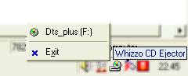



## CD Ejector

### Description

CD Ejector.

CD Ejector runs in the system tray. When you click on it you get a menu with a list of your CD/CDR/CDRW/DVD drives. Click on the drive you want to Eject/Close and wait a second. Click the exit button to close and remove from system tray.

See Screenshot.
 
### More Info
 

             |
---                |---
**Submitted On**   |2002-07-10 22:43:28
**By**             |[CoderFromHell](https://github.com/Planet-Source-Code/PSCIndex/blob/master/ByAuthor/coderfromhell.md)
**Level**          |Advanced
**User Rating**    |5.0 (40 globes from 8 users)
**Compatibility**  |VB 5\.0, VB 6\.0
**Category**       |[Complete Applications](https://github.com/Planet-Source-Code/PSCIndex/blob/master/ByCategory/complete-applications__1-27.md)
**World**          |[Visual Basic](https://github.com/Planet-Source-Code/PSCIndex/blob/master/ByWorld/visual-basic.md)
**Archive File**   |[CD\_Ejector1046397102002\.zip](https://github.com/Planet-Source-Code/coderfromhell-cd-ejector__1-36785/archive/master.zip)

